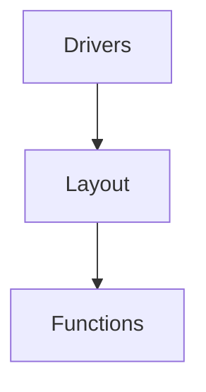

# Key-Server WORK IN PROGRESS
A server that interfaces with the Raspberry Pi's GPIO and sends mouse and key events based on hardware input to either the Pi or host.

## Usage
```
Cli Args

Usage: key-server [OPTIONS]

Options:
  -c, --config <CONFIG>  Path to config directory
  -h, --help             Print help information
```

## Overview
The key-server can be broken up into 3 main parts:

Drivers interface with GPIO, the layout abstracts the driver input into a grid of keys, or keyboard layout, and functions are bound to specific keys, handling the driver input at that position in the grid. The layout is separated into layers, each one a grid of bindings allowing the layout to be quickly modified and switched between. Functions perform actions like sending keystrokes, and moving the mouse.

### Modules
Modules allow external libraries to handle the driver, function, and HID logic. There are built in functions and HIDs but drivers must be supplied through modules. See [key-module](../../lib/key-module/).

### Variables
Variables can be used to share configuration between functions or to change the configuration of a function at runtime. Variables can be defined globally or locally in functions. Global variables can be saved after being changed at runtime.

e.g. a sensitivity variable shared across two functions that handle mouse movements

### RPC
The key-server can be interfaced with using RPC. See [key-rpc](../../lib/key-rpc/).

## Configuration
The key-server will either use a folder, called key-server, in the systems default user configuration folder or the folder specified by the user as it's configuration folder.

It expects:
- "drivers", a folder containing all driver configuration files
- "modules", a folder containing all modules to load
- "variables.json", a global variable specification file
- "layout.json", a layout configuration file
- "frontend.json", a front end configuration file
- "config.yaml", a logging configuration file


### Drivers
Drivers are configured by creating configuration files in the "drivers" folder. The name of the file specifies the name of the driver and module the driver should be created with, separated by a hyphen. e.g. "{name}-{module name}". The contents of the file is parsed by the drivers module and typically contains module specific configurations.

The driver will then provide the layout with a list of inputs/outputs that can be bound.

### Modules
 See [key-module](../../lib/key-module/).

### Variables
The variables configuration file configures global variables. It expects a json list of variable definitions. A variable definition is an object with the field "name", the name of the variable, and "default", the default value encoding as a json string. How the value is deserialized from json is determined by the type a function that uses that variable is expected. If it fails to deserialize due to it being the wrong type or being malformed it will default to the functions default value for that parameter.

```json
[
    {
        "name": "sensitivity",
        "default": "100",
    }
]
```

### Layout
The layout configuration file configures the key-server layout, and function and driver bindings. It expects a json object containing the fields "width", the grid width, "height", the grid height, "bound", a list of driver grid bindings, and "layers", a list of layers each one a 2d list function grid bindings.

A driver binding expects an Address to bind to the grid. This can be:
```
DriverMatrix {
    name: String, driver name
    input: Range<usize>, range of inputs to bind
    width: usize, width of the matrix
    root: (usize, usize), layer coord to start binding too 
}
DriverAddr {
    name: String, driver name
    input: usize, input
    root: (usize, usize), layer coord to bind too
}
None
```

```json 
[
    {
        "DriverAddr": {
            "name": "GPIO1",
            "input": 0,
            "root": [0,0],
        }
    }
]
```

A driver matrix takes a list of inputs from a driver and binds them in a grid with a given width on the layout. A driver address binds an input to a point on the layout. None binds nothing.


A layer is a list of rows. A row is a list of function bindings. 
```json
[
    [{"Key": "a"}, {"Key": "b"}, {"Key": "c"}],
    [{"Key": "d"}, {"Key": "e"}, {"Key": "f"}],
    [{"Key": "g"}, {"Key": "h"}, {"Key": "j"}]
]
```

See function::FunctionType for function binding configurations.

### Frontend
The frontend consists of builtin services, such as nanomsg and midi, and misc key-server functionality. This can be configured in the "frontend.json" configuration file and consists of a list of configuration objects.

Configuration objects:
```
HID {
    mouse: String, mouse hid device path
    keyboard: String, keyboard hid device path
    led: String, led hid device path (may be the same as the keyboard path)
}
NanoMsg {
    pub_addr: String, publisher address (used by the key-server)
    sub_addr: String, subscriber address (used by external listeners)
    timeout: i64
}
```

```json
[
    {
        "NanoMsg": {
            "pub_addr": "ipc:///lmk/pub.ipc",
            "sub_addr": "ipc:///lmk/sub.ipc",
            "timeout": 100,
        }
    }
]
```

### Logging
See [log4rs crate](https://docs.rs/log4rs/latest/log4rs/#configuration-via-a-yaml-file)